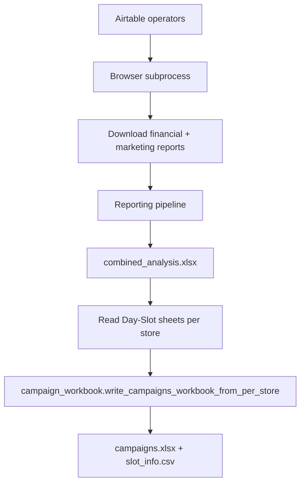
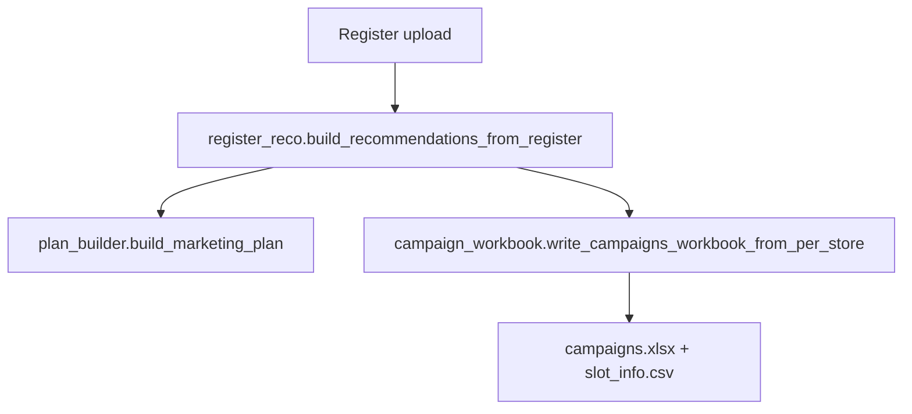

# Strategist Agent — Logic Reference

The Strategist turns DoorDash performance data into **store-wise campaign plans**: which day/slot gets an **Offer** (discount promo) vs **Ads** (sponsored listing), grouped into portal-ready campaigns with DoorDash schedule tags (1–42).

Outputs feed **Ralph Offers** and **Ralph Ads** browser automation.

---

## Modes

| Mode | Input | Browser | Output folder |
|------|--------|---------|----------------|
| **Auto** | Operator(s) from Airtable | Yes — downloads financial + marketing reports | `data/Strategist/<business name>/<timestamp>/` |
| **Manual** | Uploaded DD register (`.xlsx` / `.xls` / `.csv`) | No | Same layout |

Both modes produce the **same deliverables** when planning succeeds:

- `campaigns.xlsx` — **Offers Campaigns** + **Ads Campaigns** sheets  
- `slot_info.csv` — one row per store × day × slot (42 rows per store)  
- `result.json` — run metadata (manual always; auto per operator in API wrapper)

Manual mode also writes `marketing_plan.json` under `data/operators/<operator_id>/reports/`.

---

## High-level flow

### Auto mode



1. **Date range** — last **3 complete calendar months** (`_date_range_90_days`): from the 1st of month (today − 3) through the last day of the prior month.
2. **Phase 1 (subprocess)** — `browser-use` logs into DoorDash, downloads reports into `<run>/downloads/`, with retry if a file is missing.
3. **Phase 2** — Reporting `marketing_agent` + `analysis_agent` on downloaded files.
4. **Phase 3** — `combined_report_agent` builds combined workbook; campaign mappings may be appended from `slots.csv` / combined analysis rules in the reporting fork.
5. **Phase 4 (parent process)** — Read `Day-Slot - {store_id}` sheets → build `campaigns.xlsx` + `slot_info.csv`.

### Manual mode



No portal login. Register rows are normalized (currency, column aliases, day names) then run through the **same slot classification and workbook builder** as auto.

---

## Slot grid (tags 1–42)

DoorDash custom schedule uses **6 dayparts × 7 weekdays** = 42 tags.

| Daypart (row) | Monday | Tuesday | … | Sunday |
|---------------|--------|---------|---|--------|
| Overnight | 1 | 2 | … | 7 |
| Breakfast | 8 | 9 | … | 14 |
| Lunch | 15 | … | … | 21 |
| Afternoon | 22 | … | … | 28 |
| Dinner | 29 | … | … | 35 |
| Late night | 36 | … | … | 42 |

**Formula** (see `shared/campaign_planning/ralph_ads_excel.slot_table_row_to_schedule_tag`):

```
tag = daypart_index × 7 + day_index + 1
```

- `daypart_index`: Overnight=0 … Late night=5  
- `day_index`: Monday=0 … Sunday=6  

Day and slot names are normalized via `shared.time_slots.normalize_slot_name` (e.g. `Thu` → full weekday where needed).

---

## Core decision rule (Offers vs Ads)

**Auto and manual share the same helpers** in `register_reco.py` — called from `campaign_workbook`, `slot_info`, and `build_recommendations_from_register`.

### Offers

Applied **per store × day × slot**:

| Condition | Campaign type |
|-----------|----------------|
| **Orders = 0 and Sales = 0** | No offer |
| Has activity and uplifted min subtotal &gt; 0 | **Offer** (`TODC-{store}-${min_subtotal}`) |

```python
# register_reco.classify_slot_action — offer assignment
if orders == 0 and sales == 0:
    return "none", 0
min_sub = uplift_min_subtotal(aov)
return ("promo", min_sub) if min_sub > 0 else ("none", 0)
```

### Ads

Per store, rank **active** slots (orders &gt; 0 or sales &gt; 0) by **orders**. The **bottom 8** get sponsored listings merged into one `TODC-ADS-{store_id}` campaign. Each of those slots also has an offer, so `slot_info.csv` shows **Offer + Ads** with both campaign names.

Constants (`register_reco.py`):

- `BOTTOM_ADS_SLOT_COUNT = 8`
- `ADS_WEEKLY_BUDGET = 140` — weekly budget on every Ads campaign row
- `ADS_MIN_BID = 3` — fixed minimum bid on every Ads campaign row

A slot can be **Offer**, **Ads**, **Offer + Ads**, or **None**. `profitability_pct` is shown in manual UI rationale only; it does **not** change the branch.

---

## Minimum subtotal (Offers)

For promo slots, min subtotal is **uplifted AOV** (parity with Reporting `analysis_agent`):

```python
uplift = aov × 1.2
min_subtotal = ceil(uplift / 5) × 5   # round up to nearest $5
```

If AOV is missing or ≤ 0, min subtotal is 0 and the slot does not join an Offers campaign group.

---

## Campaign naming

| Type | Pattern | Example |
|------|---------|---------|
| Offer | `TODC-{store_id}-${min_subtotal}` | `TODC-10661-$20` |
| Ads | `TODC-ADS-{store_id}` | `TODC-ADS-10661` |

### Grouping in `campaigns.xlsx`

- **Offers** — slots with the same `store_id` **and** same `min_subtotal` are merged into **one campaign**; `Slot Tags` is a comma-separated sorted list of tags.
- **Ads** — bottom-8-by-orders slots per store are merged into **one campaign** per store; one tag list, bid (`ADS_MIN_BID`), and weekly budget (`ADS_WEEKLY_BUDGET`).

Initial **Status** on all planned rows: `Pending`.

---

## `campaigns.xlsx` sheets

Written by `campaign_workbook.write_campaigns_workbook_from_per_store` (auto + manual).

### Offers Campaigns

| Column | Description |
|--------|-------------|
| Store ID | Merchant store ID |
| Store Name | From Store-wise sheet or register |
| Minimum Subtotal | Uplifted $ threshold |
| Slot Tags | Comma-separated 1–42 |
| Campaign Name | `TODC-{id}-${subtotal}` |
| Status | `Pending` → updated by Ralph Offers after portal run |

### Ads Campaigns

| Column | Description |
|--------|-------------|
| Store ID | Merchant store ID |
| Store Name | |
| Minimum Bid | Always `3` |
| Weekly Budget | Always `140` |
| Slot Tags | Comma-separated 1–42 |
| Campaign Name | `TODC-ADS-{store_id}` |
| Status | `Pending` → updated by Ralph Ads |

---

## `slot_info.csv`

Built by `slot_info.build_slot_info_rows_auto` (auto/manual via workbook path).

- **42 rows per store** — full grid, including empty slots (`Campaign Type = None`, `Campaign Name = no campaign`).
- Columns: Store ID, Store Name, Day, Slot, Slot Tag, Orders, Sales, AOV, Campaign Type, Campaign Name, Ads Campaign Name, Minimum Subtotal, Minimum Bid, Status.

Used for auditing slot-level assignments and status writeback alongside the workbook.

---

## Auto mode: reading combined analysis

`_read_day_slots_per_store(combined_path)` opens sheets matching `Day-Slot - {store_id}` (header row 3). Required columns: `Day`, `Slot`, `Min.Subtotal`, `AOV`; also reads `Sales`, `Orders`.

`_read_store_names` prefers **Store-wise** / **Financial Store-wise** sheet; falls back to financial CSV columns.

---

## Manual mode: register parsing

`register_reco.load_register_df` accepts flexible column names, including Super App export style:

- Store: `Merchant Store ID`, `Store ID`, …
- Metrics: `Sales`, `Payouts`, `Orders`, `Orders (GC)`, `AOV` (currency strings like `$12.34` parsed)
- Time: `Day` / `Day part` (abbreviations normalized to full weekday + canonical slot)

`build_recommendations_from_register` returns:

| Key | Purpose |
|-----|---------|
| `per_store` | Same shape as auto — feeds workbook builder |
| `store_names` | ID → name map |
| `campaign_mappings` | Grouped promo rows (legacy/marketing plan) |
| `slot_recommendations` | Per-slot audit with action + rationale |
| `ads_plan` | `slot_table` for Ads UI / `ralph_ads_upload_rows` |

`register_to_per_store` computes `min_subtotal` via `uplift_min_subtotal` for promo-eligible slots only.

---

## Downstream: Ralph Offers & Ralph Ads

`shared/strategist_campaign_sheets.py` resolves the **latest** run:

```
data/Strategist/<operator>/<timestamp>/campaigns.xlsx
```

- **Offers** reads **Offers Campaigns** sheet → browser combos.  
- **Ads** reads **Ads Campaigns** sheet → browser rows.  
- **`slot_info.csv`** resolved beside the workbook for status writeback.

**Skip on re-run:** only `Successful` / `Success` rows are skipped; `Pending`, `Failed`, and `Skipped (duplicate)` are retried.

After each portal campaign, status is written back to both `campaigns.xlsx` and `slot_info.csv` (`write_strategist_campaign_statuses`).

---

## Module map

| File | Role |
|------|------|
| `agent.py` | Entry `run()`, auto subprocess orchestration, manual wrapper, date range, operator resolution |
| `register_reco.py` | Register load/normalize, AOV rule, uplift, slot tags, `build_recommendations_from_register` |
| `campaign_workbook.py` | `campaigns.xlsx` + `slot_info.csv` from `per_store` metrics |
| `slot_info.py` | 42-slot grid export, campaign type per cell |
| `plan_builder.py` | `MarketingPlan` JSON from mappings + ads_plan (manual) |
| `campaigns_excel.py` | Richer `marketing_plan.xlsx` (Offers / Ads / Register slots tabs) — manual/legacy UI |
| `promo_planner.py` | Separate promo ROAS analysis from MARKETING_PROMOTION CSVs (not the main slot grid path) |

---

## API & dashboard

- `POST /api/runs/strategist` — auto (queued, browser) or manual (background thread).  
- Downloads: `/api/runs/strategist/{run_id}/download/campaigns`, `.../slot-info`.  
- **StrategistPage** — operator multi-select (auto) or register upload (manual).

---

## Configuration

| Setting | Source |
|---------|--------|
| Reporting fork | `marketingreco_reporting_root()` → default `agents/reporting_browser_use` |
| Operators / credentials | Airtable via `load_account_operators` |
| Output root | `data/Strategist/` |
| Optional slots file | `agents/reporting_browser_use/slots.csv` (tag lookup in manual mode) |

---

## Related tests

- `tests/test_register_reco.py` — register parsing, currency, Super App columns  
- `tests/test_strategist_slot_info.py` — slot_info grid  
- `tests/test_strategist_campaign_sheets.py` — workbook load, status writeback, skip rules  
- `tests/test_campaign_pipeline.py` — end-to-end planning hooks  
