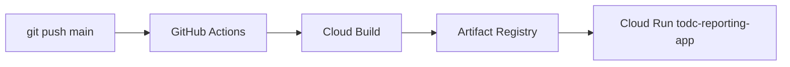

# Path A: Deploy RalphAI via Git → CI → Cloud Build → Cloud Run

Deploys to your existing Cloud Run service **`todc-reporting-app`** in project **`todc-marketing`** (`us-central1`). Each push **replaces the running image** (old revisions stay available for rollback in Console → Revisions).

Production URL (unchanged after deploy):

`https://todc-reporting-app-886692368169.us-central1.run.app`

That service serves:

- RalphAI workspace dashboard (`/`)
- FastAPI (`/api/...`)
- The Super App (`/internal-apps/the-super-app/`)
- Health Check, exports, etc.

---

## What you do (one-time)

### 1. Prerequisites on your laptop

- [Google Cloud SDK](https://cloud.google.com/sdk) (`gcloud`)
- Billing enabled on a GCP project
- This repo pushed to GitHub (e.g. `nithintodc/RalphAI`)
- Local `.env` with at least `AIRTABLE_PAT` (and `todc-marketing-*.json` for Drive export)

### 2. Bootstrap GCP + deploy key

```bash
cd /path/to/RalphAI
export GCP_PROJECT_ID=todc-marketing
export GCP_REGION=us-central1
gcloud auth login
./scripts/gcp-bootstrap.sh
```

This enables APIs, creates Artifact Registry `ralphai`, deploy service account, Secret Manager entries, and writes **`.gcp/ralphai-github-deploy-key.json`** (gitignored).

### 3. GitHub repository secrets

**Settings → Secrets and variables → Actions → New repository secret**

| Secret | Value |
|--------|--------|
| `GCP_PROJECT_ID` | Your GCP project ID |
| `GCP_REGION` | `us-central1` (or your region) |
| `GCP_SA_KEY` | **Full JSON** from `.gcp/ralphai-github-deploy-key.json` |

### 4. Optional GitHub repository variables

**Settings → Secrets and variables → Actions → Variables**

| Variable | Example |
|----------|---------|
| `AIRTABLE_BASE_ID` | `app80FBnaszl1aldw` |
| `AIRTABLE_TABLE_ID` | `tblOQLzzHIS4Sw3Km` |
| `CORS_ORIGINS` | `https://ralphai-xxxxx.run.app` (after first deploy) |
| `GOOGLE_SHARED_DRIVE_NAME` | `Data-Analysis-Uploads` |

### 5. Finish Secret Manager values (if bootstrap skipped any)

```bash
gcloud config set project YOUR_PROJECT_ID

# Airtable
echo -n 'patXXXXXXXX' | gcloud secrets versions add AIRTABLE_PAT --data-file=-

# Anthropic (optional, for LLM agents)
echo -n 'sk-ant-...' | gcloud secrets versions add ANTHROPIC_API_KEY --data-file=-

# Google service account (Drive/Sheets export)
gcloud secrets versions add todc-export-sa-json \
  --data-file=agents/the_super_app/streamlit_app/todc-marketing-XXXX.json
```

### 6. Push to deploy

```bash
git add .
git commit -m "Enable Path A Cloud Run deploy"
git push origin main
```

Open **GitHub → Actions → “Deploy RalphAI (Cloud Run)”**. When green, the job summary shows your **Cloud Run URL**.

### 7. Smoke test production

- Open `https://YOUR-SERVICE-xxx.run.app`
- Agents → The Super App → upload / configure / analyze
- Health Check, Breakdown tab
- Export (needs `todc-export-sa-json` secret)

---

## What happens on each push to `main`



1. **Checkout** repo  
2. **Authenticate** with `GCP_SA_KEY`  
3. **`gcloud builds submit`** — builds `infra/gcp/Dockerfile.api` (dashboard + Super App + API)  
4. **`gcloud run deploy`** — rolls out new revision with secrets from Secret Manager  

Manual rerun: **Actions → Deploy RalphAI → Run workflow**.

---

## Files in this repo

| File | Purpose |
|------|---------|
| `.github/workflows/deploy-ralphai.yml` | CI/CD pipeline |
| `infra/gcp/cloudbuild.yaml` | Cloud Build: docker build + push |
| `infra/gcp/Dockerfile.api` | Production image |
| `scripts/gcp-bootstrap.sh` | One-time GCP + GitHub prep |
| `scripts/prepare-deploy.sh` | Local build/test before push |

---

## Troubleshooting

| Issue | Fix |
|-------|-----|
| Workflow fails at Cloud Build | Check Actions log; run `./scripts/prepare-deploy.sh` locally |
| `Permission denied` on build | Re-run bootstrap; confirm deploy SA roles |
| Super App 503 “not built” | Dockerfile builds Super App; ensure workflow uses latest commit |
| Airtable empty | Set `AIRTABLE_PAT` secret version in GCP |
| Export fails | Set `todc-export-sa-json` + Shared Drive access |
| Rollback | Cloud Run → Revisions → route traffic to previous revision |

---

## Cost (rough)

Cloud Run scale-to-zero: ~$0–50/mo light use. No Firebase required for Path A.
